<div align="center">



[](https://ahmedtamer-1.github.io)
[](https://www.linkedin.com/in/ahmedtamer)
[](mailto:ahmed.omar.aser@gmail.com)

</div>

---

Software Engineering student at **AASTMT** (GPA 3.4/4.0 · Class of 2027).
I ship real products — not just homework assignments.

Co-founded **[Lume Egy]([lumeegy.com](https://lumeegy.com/))**(currently under maintanince) — a live e-commerce fashion brand where I own the entire technical stack: storefront development, paid-media pixel infrastructure, and fulfillment integrations. **EGP 49,000+ in gross sales** with a **2.4% peak conversion rate** within months of launch.

Technical Partner at **Adorna** (20% equity) — leading all pre-launch infrastructure, storefront architecture, and marketing pixel systems.

Beyond commerce I build multiplayer game systems, cross-platform mobile apps, full-stack web platforms, and systems-level tooling.

<div align="center">
</div>

---

<div align="center">

**LANGUAGES**


**FRAMEWORKS + PLATFORMS**


**DATABASES + INFRA**


**DESIGN + TOOLS**


</div>

---

<div align="center">
  
  &nbsp;&nbsp;
  
</div>

<div align="center">
  
</div>

---

```
 FULL-STACK DEV ──────── frontend → backend → database → deploy.
                         complete features, not just components.

 MOBILE ─────────────── cross-platform (Flutter) + native (Kotlin).
                         clean architecture, real apps on real devices.

 GAME DEV ───────────── multiplayer systems. Mirror Networking + EOS.
                         real-time sync, matchmaking, the hard stuff.

 E-COMMERCE + GROWTH ── built and scaled two live storefronts.
                         Shopify → WordPress. pixels, media buying, fulfillment.

 3D + DESIGN ────────── Blender, CLO3D, Figma.
                         wireframes to 3D product mockups.

 SYSTEMS ────────────── Unix internals, process management, shell scripting.
```

---

**Arabic** native · **English** C1 advanced · **Japanese** basic · **Korean** basic

---

Open to projects, collaborations, internships, or good technical conversation.

<div align="center">

[](mailto:ahmed.omar.aser@gmail.com)
[](https://www.linkedin.com/in/ahmedtamer)
[](https://ahmedtamer-1.github.io)

</div>

<div align="center">


</div>
